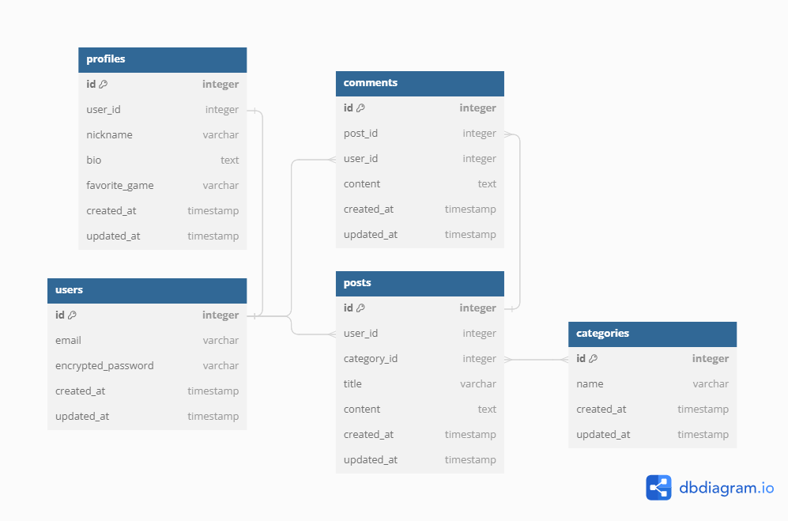

# ABOUT THE CODE BASE

This is a Gaming Blog App - developed by Harieshwar Jagan Abirami towards Final Project Submission for SEP-759 Prototyping Web and Mobile Applications - Course in McMaster University.

* Ruby version - 3.0.3

* System dependencies - PostgreSQL

# INSTRUCTIONS TO RUN :

1.	Install PostgreSQL
2.	Run “bundle install”
3.	Edit “config/database.yml” file to match the PostgreSQL settings (username, password)
4.	Run “rails db:create” 
5.	Run “rails db:migrate”
6.	Run “rails db:seed”
7.	Run “rails s”

The live app link is [here](https://gaming-blog-app.onrender.com).

# TEST DATA
*Email: user1@example.com
Password: password*

# POSTMAN API REQUESTS
## Attached with this repository: <strong>Gaming Blog API.postman_collection.json</strong>

# APPLICATION FLOW DESCRIPTION
## Step 1: User Authentication
•	Sign Up: As a new user, the first thing I do is sign up for an account using my email and a secure password. The application uses Devise, a Ruby gem, to handle this process, ensuring my information is securely stored.
•	Login: Once registered, I can log in to access my profile and interact with posts. Devise handles the login process, checking my credentials against the stored information.
•	Logout: When I'm done, I can log out. This action is important for security, especially on shared devices, as it clears my session data.
## Step 2: Managing User Profile
•	Viewing My Profile: After logging in, I can view my profile by clicking the "My Profile" button. This page displays information like my nickname, a short bio, and my favorite game.
•	Editing My Profile: I can edit my profile to update my information. This might include changing my bio or updating my favorite game to reflect my current preferences.
## Step 3: Interacting with Posts
•	Home Page and Post Listing: The home page lists all the posts created by users. Each post displays a title and a snippet of its content, making it easy to skim through.
•	Creating a New Post: As a logged-in user, I can create a new post by clicking the "New Post" button. I'm prompted to enter a title, the content of the post, and select or enter new categories.
•	Viewing a Post: By clicking on a post's title, I can view its full content. This page also shows comments from other users and allows me to add my own comment.
## Step 4: Categories
•	Exploring Categories: A dedicated page lists all available categories. This feature helps me explore posts grouped by specific topics or themes.
•	Filtering Posts by Category: When I select a category, the application shows me all the posts associated with it. This allows me to focus on areas of interest.
## Step 5: Commenting System
•	Adding Comments: On a post’s detailed view, I can type and submit my comment. This fosters community interaction and discussion.
•	Deleting Comments: I can delete any comment I've made. This option is handy if I change my mind or make a typo.
## Step 6: Navigation and User Interface
•	Navigational Buttons: The application includes buttons for "Home", "New Post", "My Profile", and "Logout". These are clearly visible and make it easy to navigate through the application.
•	Background and Styling: The application features a visually appealing background that enhances the user experience. The CSS styling is consistent across the application, providing a cohesive look and feel.
Conclusion
As a student exploring this Rails application, I appreciate its structured approach to content creation and sharing, user interaction, and content organization through categories. The application combines functional features with an appealing interface, making it an excellent learning tool for understanding web development concepts with Ruby on Rails.

# DB ENTITY RELATIONSHIP DIAGRAM

